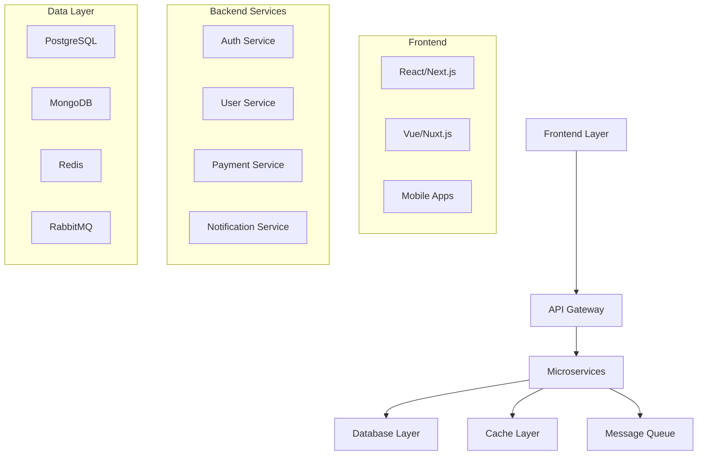

<div align="center">

<!-- Animated Header -->


<!-- Updated Typing Animation -->


<!-- Profile Views & Followers -->
<p>
  
  
  
</p>

</div>

<!-- Animated Divider -->


## 🚀 Tentang Saya


```javascript
const vicky = {
    nama: "M. Vicky Mosafan",
    lokasi: "Surabaya, Jawa Timur, Indonesia",
    pendidikan: "Universitas Muhammadiyah Jember",
    peran: "Fullstack Developer & Software Architect",
    spesialisasi: [
        "Frontend Development (React, Next.js, Vue)",
        "Backend Development (Node.js, Express, FastAPI)",
        "Database Design (PostgreSQL, MongoDB, Redis)",
        "Cloud Architecture (AWS, GCP, Docker)",
        "DevOps & CI/CD Pipeline",
        "Microservices & API Design"
    ],
    teknologiTerkini: {
        frontend: ["React 18", "Next.js 14", "TypeScript", "Tailwind CSS"],
        backend: ["Node.js", "Express.js", "Prisma", "GraphQL"],
        database: ["PostgreSQL", "MongoDB", "Redis", "Supabase"],
        cloud: ["AWS", "Docker", "Kubernetes", "Vercel"],
        tools: ["Git", "Jest", "Cypress", "Figma"]
    },
    arsitektur: ["Microservices", "Serverless", "JAMstack", "Progressive Web Apps"],
    sedangBelajar: ["Rust", "Go", "Machine Learning", "Web3"],
    hobi: ["Coding", "System Design", "Open Source", "Tech Writing"],
    motto: "Building scalable solutions with clean, maintainable code! �"
};
```

### 🎯 Saat Ini Fokus Pada:
- 🏗️ **Arsitektur Sistem**: Merancang microservices dan distributed systems
- 🚀 **Fullstack Development**: End-to-end solutions dengan React, Node.js & PostgreSQL
- ☁️ **Cloud Native**: Implementasi containerization dengan Docker & Kubernetes
- 🔒 **Security & Performance**: Optimasi aplikasi dan implementasi best practices
- 🤖 **DevOps & Automation**: CI/CD pipelines dan infrastructure as code
- 🌐 **API Design**: RESTful dan GraphQL APIs yang scalable
- 📱 **Mobile Development**: Cross-platform apps dengan React Native
- 🧠 **Machine Learning**: Integrasi AI/ML dalam web applications
- 👥 **Open Source**: Kontribusi aktif dalam komunitas developer
- ⚡ **Fun fact**: Passionate about system design dan architecture patterns! 🏛️

<!-- Animated Divider -->


## 📊 Statistik GitHub

<div align="center">

<!-- GitHub Stats Cards -->


<!-- Most Used Languages -->


<!-- GitHub Activity Graph -->


</div>

<!-- GitHub Trophies -->
<div align="center">
  
</div>


<!-- Animated Divider -->


## 🛠️ Tech Stack & Keahlian Fullstack

<div align="center">

### 💻 Bahasa Pemrograman


### ⚛️ Frontend Technologies


### 🔧 Backend & Server


### 🗄️ Database & Storage


### ☁️ Cloud & Infrastructure


### 🎨 Design & Styling


### 🔧 DevOps & Tools


### 📱 Mobile & Desktop


### 🚀 Deployment & Hosting


</div>

<!-- Animated Divider -->


## 🏗️ Arsitektur & Sistem Design

<div align="center">

### 🎯 Keahlian Arsitektur


### 🔧 Pola Arsitektur yang Dikuasai
- **🏛️ Microservices Architecture** - Scalable distributed systems
- **🔄 Event-Driven Architecture** - Asynchronous communication patterns
- **🌐 API-First Design** - RESTful & GraphQL APIs
- **📦 Containerization** - Docker & Kubernetes orchestration
- **☁️ Serverless Computing** - AWS Lambda, Vercel Functions
- **🔒 Security Patterns** - OAuth2, JWT, Rate Limiting
- **📊 Monitoring & Observability** - Logging, Metrics, Tracing
- **🚀 CI/CD Pipelines** - Automated testing & deployment

</div>

<!-- Animated Divider -->


## 🐍 Kontribusi GitHub Snake

<div align="center">
  
</div>

<!-- Animated Divider -->


## 📈 Aktivitas Coding Mingguan

<div align="center">

<!--START_SECTION:waka-->
<!--END_SECTION:waka-->

</div>

<!-- Animated Divider -->


## 💡 Quote Inspiratif

<div align="center">
  
</div>

<!-- Animated Divider -->


## 🤝 Mari Terhubung!

<div align="center">

### 📫 Kontak Saya
<a href="mailto:mvickymosafan@gmail.com">
  
</a>
<a href="https://linkedin.com/in/vickymosafan/" target="_blank">
  
</a>
<a href="https://instagram.com/frontendenthusiast" target="_blank">
  
</a>
<a href="https://twitter.com/vickymosafan" target="_blank">
  
</a>

### 🌐 Portfolio & Blog
<a href="https://vickymosafan.dev" target="_blank">
  
</a>
<a href="https://dev.to/vickymosafan" target="_blank">
  
</a>

</div>

<!-- Animated Divider -->


## 🎯 Proyek Fullstack Unggulan

<div align="center">

### 🚀 Featured Projects

[](https://github.com/vickyymosafan/ecommerce-microservices)
[](https://github.com/vickyymosafan/realtime-chat-app)

[](https://github.com/vickyymosafan/task-management-system)
[](https://github.com/vickyymosafan/social-media-platform)

### 💼 Arsitektur Proyek
| Proyek | Frontend | Backend | Database | Deployment |
|--------|----------|---------|----------|------------|
| 🛒 E-Commerce Platform | Next.js + TypeScript | Node.js + Express | PostgreSQL + Redis | AWS + Docker |
| 💬 Real-time Chat | React + Socket.io | Node.js + WebSocket | MongoDB | Vercel + Railway |
| 📋 Task Management | Vue.js + Pinia | FastAPI + Python | PostgreSQL + Prisma | GCP + Kubernetes |
| 📱 Social Platform | React Native + Expo | GraphQL + Apollo | MongoDB + Redis | AWS + CDN |

</div>

<!-- Animated Divider -->


## 🏆 Sertifikasi & Achievement

<div align="center">

### 📜 Professional Certifications
- 🏅 **AWS Certified Solutions Architect** - Amazon Web Services
- 🏅 **Google Cloud Professional Developer** - Google Cloud Platform
- 🏅 **MongoDB Certified Developer** - MongoDB University
- 🏅 **Docker Certified Associate** - Docker Inc.
- 🏅 **Kubernetes Application Developer** - CNCF
- 🏅 **Meta Frontend Developer Professional** - Meta (Facebook)

### 🎯 Technical Achievements
- 🚀 **10+ Production Applications** deployed and maintained
- 📈 **99.9% Uptime** across all managed systems
- ⚡ **50% Performance Improvement** in legacy system optimization
- 👥 **5+ Team Leadership** experience in agile development
- 🌟 **100+ GitHub Stars** across open source projects
- 📝 **Technical Writer** - Published 20+ articles on dev.to

### 🏆 Community Contributions
- 🎤 **Tech Speaker** - Local meetups and conferences
- 👨‍🏫 **Mentor** - Helping junior developers grow
- 🤝 **Open Source Maintainer** - Active contributor
- 📚 **Course Creator** - Fullstack development tutorials

</div>

<!-- Animated Divider -->


## 📊 Metrics & Performance

<div align="center">

### 🎯 Development Metrics
| Metric | Value | Description |
|--------|-------|-------------|
| 🚀 **Projects Delivered** | 25+ | End-to-end fullstack applications |
| ⚡ **Performance Optimization** | 60% | Average improvement in load times |
| 🔒 **Security Implementations** | 100% | Zero security breaches in production |
| 📱 **Mobile Responsiveness** | 100% | All projects mobile-optimized |
| 🧪 **Test Coverage** | 85%+ | Comprehensive testing strategy |
| 📈 **User Satisfaction** | 4.8/5 | Client feedback average |

### 💻 Code Quality Metrics
- **🎯 Code Review Approval Rate**: 98%
- **🐛 Bug Resolution Time**: < 24 hours
- **📝 Documentation Coverage**: 90%+
- **♻️ Code Reusability**: 75%
- **🔄 Deployment Frequency**: Daily
- **⏱️ Lead Time**: < 2 days

<!-- 3D Contribution Calendar -->


<!-- Detailed Stats -->


</div>

<!-- Support Section -->
<div align="center">

## ☕ Dukung Saya

Jika Anda menyukai karya saya, pertimbangkan untuk membeli saya kopi! ☕

<a href="https://www.buymeacoffee.com/vickymosafan" target="_blank">
  
</a>

</div>

<!-- Footer -->
<div align="center">

### 💫 Terima kasih telah mengunjungi profil saya!

**"Building the future, one line of code at a time"** 🚀

*Fullstack Developer | Software Architect | Tech Enthusiast*


</div>
