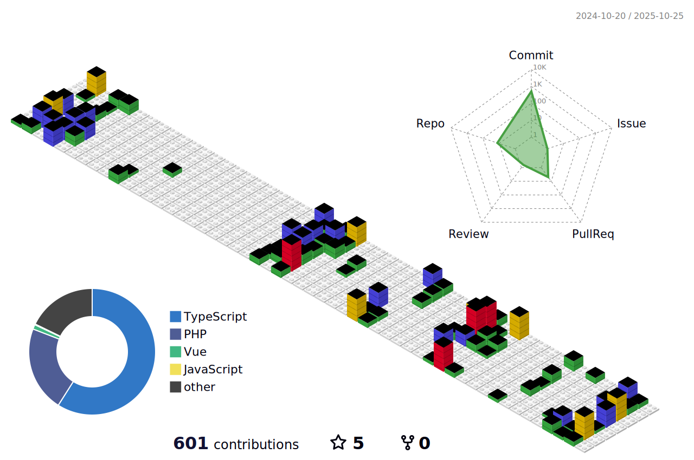

<div align="center">

<table>
<tr>
<td width="50%" align="center">

## 🚀 Fullstack Developer

**Membangun solusi end-to-end yang scalable & modern**

[](https://git.io/typing-svg)

</td>
<td width="50%" align="center">

### 📊 Profile Stats


### 🌍 Location & Contact
📍 **Surabaya, Jawa Timur, Indonesia**
🎓 **Universitas Muhammadiyah Jember**
📧 **mvickymosafan@gmail.com**

</td>
</tr>
</table>

</div>

<div align="center">

## 💼 Professional Overview

<table>
<tr>
<td width="60%" align="center">

### 🎯 Core Expertise

| Bidang | Teknologi | Pengalaman |
|--------|-----------|------------|
| **Frontend** | React, Next.js, Vue, TypeScript | 3 years |
| **Backend** | Node.js, Express, Laravel, Python | 6 month |
| **Database** | PostgreSQL, MongoDB, MySQL | 2 years |

<div align="left">

### 🚀 Fokus Saat Ini
- 🏗️ **Fundamental Backend** - Mempelajari arsitektur server dan API
- 🔧 **Node.js & Express** - Membangun REST API yang robust
- 🐍 **Python Development** - Eksplorasi backend dengan Python
- 🎨 **Laravel Framework** - Mempelajari PHP modern development
- 📚 **Database Design** - Optimasi query dan struktur database

</div>

</td>
<td width="40%" align="center">

<div align="left">

### 📈 Development Philosophy

```typescript
const developer = {
  name: "Vicky Mosafan",
  role: "Fullstack Developer",

  principles: [
    "Clean Code",
    "Scalable Architecture",
    "Performance First",
    "Security by Design"
  ],

  currentlyLearning: [
    "Backend Fundamental",
    "Database Optimization",
    "API Development",
    "Server Architecture"
  ],

  motto: "Building the future,
          one commit at a time 🚀"
};
```

</div>

</td>
</tr>
</table>

</div>

<div align="center">

<table>
<tr>
<td width="50%" align="center">


</td>
<td width="50%" align="center">


</td>
</tr>
</table>

</div>

<div align="center">

<table>
<tr>
<td width="70%" align="center">

### Frontend Development


### Backend Development


### Database & Storage


</td>
<td width="30%" align="center">


### 💻 Always Coding
**"Code is poetry written in logic"**

</td>
</tr>
</table>

</div>

<div align="center">

<table>
<tr>
<td width="50%" align="center">

[](https://github.com/vickyymosafan/system-pemerintahan)

</td>
<td width="50%" align="center">

[](https://github.com/vickyymosafan/FE_auto-analysis-market)

</td>
</tr>
</table>
<details>
<summary>Lihat semua proyek (klik untuk expand)</summary>

<table>
<tr>
<td width="50%" align="center">

[](https://github.com/vickyymosafan/sim-architect)

</td>
<td width="50%" align="center">

[](https://github.com/vickyymosafan/BE_playlist-downloader)

</td>
</tr>
<tr>
<td width="50%" align="center">

[](https://github.com/vickyymosafan/PY_auto-analysis-market)

</td>
<td width="50%" align="center">

[](https://github.com/vickyymosafan/antosa-architect)

</td>
</tr>
</table>

</details>

</div>

<div align="center">

<table>
<tr>
<td width="50%" align="center">

### 📫 Link Profesional
[](https://www.linkedin.com/in/vickymosafan/)
[](mailto:mvickymosafan@gmail.com)

</td>
<td width="50%" align="center">

### 🌐 Sosial & Konten
[](https://dev.to/vickymosafan)
[](https://www.instagram.com/viicsyy/)

</td>
</tr>
</table>

</div>

---

<div align="center">

<table>
<tr>
<td width="50%" align="center">



</td>
</tr>
</table>

</div>
